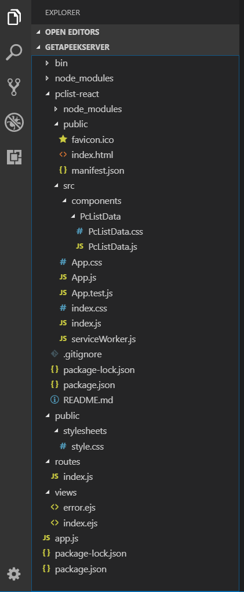
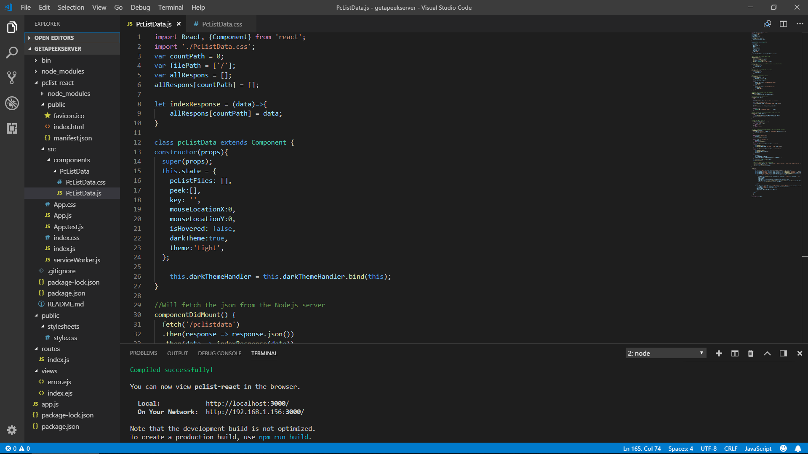

# Getapeek
Will give you the power to peek on the folders in your pc or server!

The simplest visual explorer for your pc or server, based on Node.js 
and React package for the best in-app visual effect with ease.
This project is my first React app.
The app won't do much if you want to control the files, but it will give you a great base for adding your one components and functionality. 


## Table of contents

- [My code editor](#my-code-editor)
- [Installing Nodejs and React](#installing-nodejs-and-react)
- [Get to the fun part](#get-to-the-fun-part)


## My code editor

My code editor for the last  few months is VS Code (Microsoft) - https://code.visualstudio.com/
It is really great, much better for me than Atom or Sublime (that I used in the past). 
One of its better features is the multiple terminals option that you can start within the code editor itself. 


In this repository folders, you will find the Node.js files and the React files.
You will first have to install all the Node.js and React packages on your own.

## Installing Nodejs and React

If you don't have Node.js or React on your project folder you can continue with the following steps below, else [Get to the fun part](#get-to-the-fun-part)

If you never installed Node.js on your pc go to - https://nodejs.org/en/  download and install it. 
<br>
In your Terminal ('command prompt' in windows) navigate to the folder that you will install the server and then the project in.

[cd (folder name or full path) - will go to this folder, cd.. - will go back a folder)

Then follow the next few code lines:

first, install the express generator on your pc (great way to install a Node.js server) -

```
('sudo' if you on Linux) npm install -g express-generator
```

Make sure that you in the directory that you like to install the server in and write in the console -

```
express (new folder name)
```

install ejs if you like, we will use React so no ejs or any visual js needed -

```
express --view=ejs (the newly created folder name)
```

Navigate to the server folder itself

```
cd (the newly created folder name)
```

Write ( this will install all the dependencies ):

```
npm install
```

For this project, we need to install async, a great way to control asynchronous functions with ease. For more data - https://caolan.github.io/async/

```
npm install --save async
```

Add this code to the index.js file in the server routes folder.

```
var async = require('async');
```

To start the server write -

```
npm start <br>
```
or

```
node bin/www
```

Now you have a Node.js server with express installed and active.

To install React use a very simple way officially from the Facebook react team - 

```
sudo npm install create-react-app -g<br>
create-react-app (A new folder with the project name)<br>
cd (the newly created folder name)<br>
npm start<br>
```


## Get to the fun part

If you have Node.js and React already installed on your machine don't repeat this process and copy the files in that exact order:



All the files in the node_modules folder for the server will already be present in your project folder after you will npm install. There is no need to put it here, it will be a waste of space for GitHub. 

Every file that is here in the git is a mast. You can change everything but don't delete the core files, it will break the code they are all conected.

For you to start the app:
npm start the Node.js server and at the same time start the react app
with the npm start in the 'pclist-react' folder (you will need two different terminals for that ). 

In your browser go to:

http://localhost:3000/  - to view the app.

http://localhost:8000/  - to see that your Node.js server is running well. 

(You will find a pleasant surprise there that will help you troubleshoot problems).





In the PcListData.js component you will find comments that explain what every function is doing,
but in the jsx section, you will have to figure it out on your own, it's not that complicated. 

The PcListData.css is where you control over the colors of the app include the body.  The Dark theme is my favorite and I made it because I believe every app need a mode like that to better protect our eyes for the future. 

In the index.js file on the server routes folder, you will find all the behind the scenes magic. 
